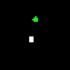
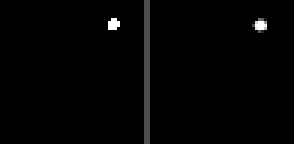

# LatentMPC — a self-supervised world-model agent

An agent that learns **how a world works from raw pixels — with no rewards and no labels** —
then **reaches goals it has never seen** by *imagining* outcomes and planning in a learned
representation space. It's a JEPA-style world model (à la Meta's V-JEPA 2-AC / LeCun's
objective-driven AI) wrapped in model-predictive control.

|  Agent reaching goals  |  Imagined vs. actual future  |
|:----------------------:|:----------------------------:|
|  |  |
| white = agent, green = a **new** goal each episode | left = what *actually* happened · right = what the model *imagined* |

## Result

| Policy | Goals reached |
|---|---|
| Random force | **12%** |
| **LatentMPC** (plans in latent space) | **100%** |

Trained in **~75 s on a single RTX 3080**. The agent never trains on goals — it only learns
the dynamics from random play, then plans each goal on the fly.

## How it works

1. **Encoder** `E : (2 stacked frames) → z` — a compact latent. Two frames so it can infer the
   dot's *hidden velocity* (the env has momentum).
2. **World model** `P : (z, force) → next z` — predicts the **future latent, not future pixels**
   (the JEPA idea). Trained multi-step from random play, with a VICReg term to prevent
   representation collapse and a small `z → position` readout used as the planning target.
3. **Planner (CEM / MPC)** — to reach a goal it samples hundreds of force sequences, **rolls
   them forward in latent space** with `P`, scores them by predicted distance to the goal,
   executes the first force, then **replans every step**.

Because random forces cancel out under momentum, only *coordinated* planning makes progress —
which is why random reaches 12% and planning reaches 100%.

## Run

```bash
pip install torch numpy imageio        # CUDA build of torch recommended
python latentmpc.py                    # trains, evaluates, writes demo.gif + imagine.gif
```

Single file, ~180 lines, no simulator/GL dependencies.

## Talking points

- A **world-model agent**: perception → a learned **latent dynamics model** → planning.
- **Self-supervised**: the world model is trained only to predict future *embeddings* from
  random play — no rewards, no goal labels.
- **Hidden-state inference**: the encoder recovers velocity from a pair of frames.
- **Zero-shot goals**: solved by *planning*, not a memorized policy.

## Roadmap

- Swap the toy env for **DeepMind Control** (cheetah / robot arm) for a portfolio-grade demo.
- Replace the readout with a **from-scratch JEPA encoder** (masking + EMA target).
- **LLM goal layer**: type *"go to the top-left"* → it plans there.
- Weights & Biases logging + ablations (horizon, latent dim, multi-step depth).
